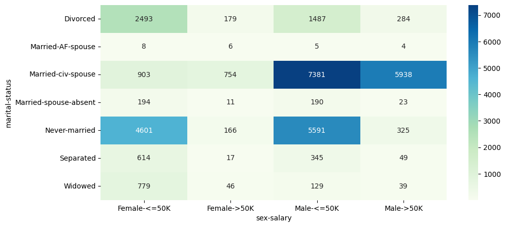
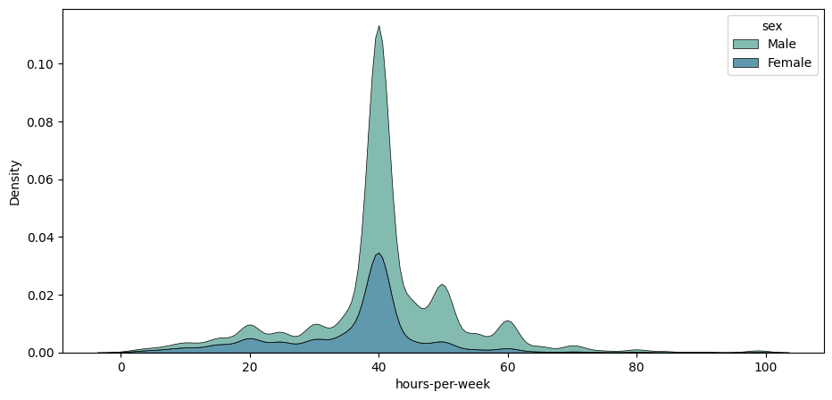
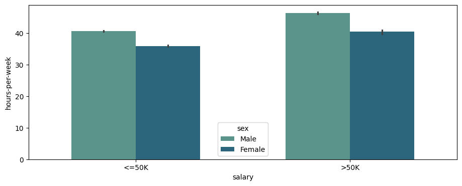
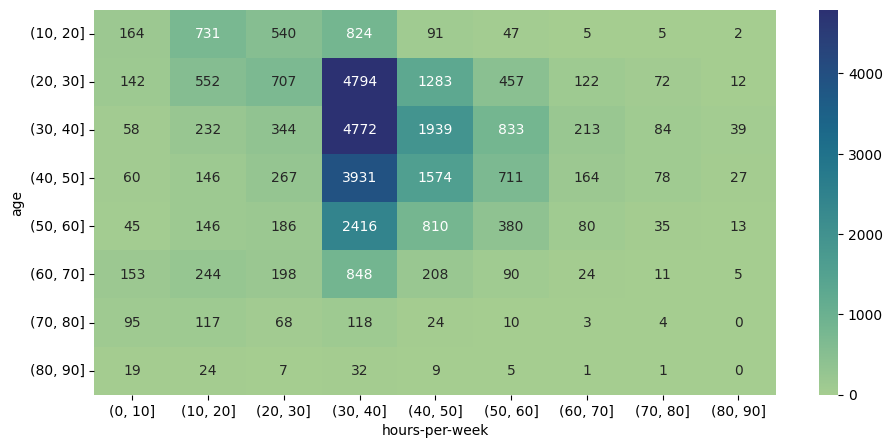
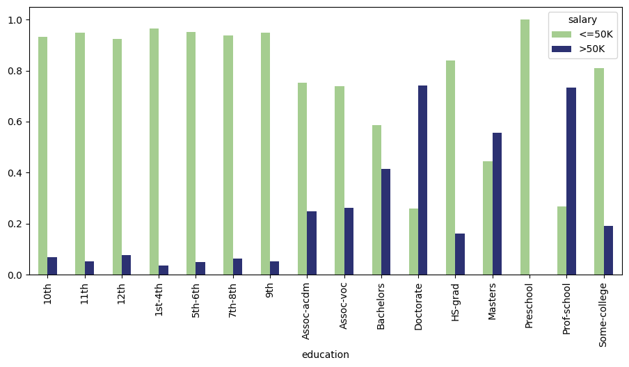

# Census Income Dataset Analysis

## Introduction
This project involves an in-depth Exploratory Data Analysis (EDA) on a comprehensive census dataset using Python and its data analysis libraries. The dataset includes a wide range of demographic variables such as age, workclass, education, marital status, occupation, relationship, race, sex, hours-per-week, native-country, and salary.

## Dataset
The dataset used is based on census data, also known as the "Census Income" dataset, contains the following features:

Age
Workclass
Fnlwgt
Education
Education-num
Marital-status
Occupation
Relationship
Race
Sex
Capital-gain
Capital-loss
Hours-per-week
Native-country

## Research Questions
The analysis aims to answer the following questions:

1. How many men and women are represented in this dataset?
2. What is the average age of women?
3. What is the percentage of German citizens?
4. What are the mean and standard deviation of age for those who earn more than 50K per year and those who earn less than 50K per year?
5. Is it true that people who earn more than 50K have at least high school education?
6. Display age statistics for each race and each gender.
7. Among whom is the proportion of those who earn a lot (>50K) greater: married or single men?
8. What is the maximum number of hours a person works per week? How many people work such a number of hours, and what is the percentage of those who earn a lot (>50K) among them?
9. Count the average time of work for those who earn a little and a lot for each country. What will these be for Japan?

## Data Visualization
Created visualizations to better understand and present these relationships. The visualizations provide insights into the relationships between variables such as marital status, sex, salary, hours worked per week, age, and education.

Here are some of the key visualizations:

## Visualization 1: Salary Distribution by Marital Status

## Visualization 2: KDE Plot of Hours per Week by Sex

## Visualization 3: Bar Plot of Salary vs Hours per Week by Sex

## Visualization 4: Heatmap of Age vs Hours per Week

## Visualization 5: Bar Plot of Education vs Salary

## EDA Conclusions

The EDA provided several insights into the dataset. Some of the key findings include:

Age seems to be a significant factor in determining salary, with older individuals generally earning more.
Education does not guarantee a high salary, as evidenced by the finding that not all high earners have at least a high school education.
Marital status also appears to correlate with salary, with married men having a higher likelihood of earning above 50K.
The dataset is predominantly composed of individuals from the United States, with very few individuals from other countries like Germany around 0.42%.
The hours-per-week column ranges from 1 to 99 with an average of approximately 40.44. The average working hours differ for high and low earners, and this difference also varies by country. For eaxample, In Japan, individuals who earn more than 50K per year work longer hours on average compared to those who earn less. The maximum number of hours a person works per week is 99.
